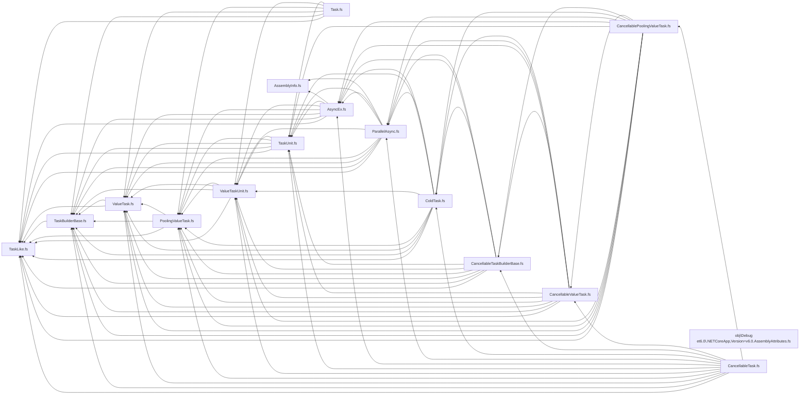

```mermaid
flowchart RL
    0["obj\Debug\net6.0\.NETCoreApp,Version=v6.0.AssemblyAttributes.fs"]
    1["AssemblyInfo.fs"]
    2["TaskLike.fs"]
    3["TaskBuilderBase.fs"]
    4["ValueTask.fs"]
    5["PoolingValueTask.fs"]
    6["ValueTaskUnit.fs"]
    7["TaskUnit.fs"]
    8["Task.fs"]
    9["AsyncEx.fs"]
    10["ParallelAsync.fs"]
    11["ColdTask.fs"]
    12["CancellableTaskBuilderBase.fs"]
    13["CancellableValueTask.fs"]
    14["CancellablePoolingValueTask.fs"]
    15["CancellableTask.fs"]
    3 --> 2
    4 --> 2
    4 --> 3
    5 --> 2
    5 --> 3
    5 --> 4
    6 --> 2
    6 --> 3
    6 --> 4
    6 --> 5
    7 --> 2
    7 --> 3
    7 --> 4
    7 --> 5
    7 --> 6
    8 --> 2
    8 --> 3
    8 --> 4
    8 --> 5
    8 --> 6
    8 --> 7
    9 --> 2
    9 --> 3
    9 --> 4
    9 --> 5
    9 --> 6
    9 --> 7
    9 --> 1
    10 --> 2
    10 --> 3
    10 --> 4
    10 --> 5
    10 --> 6
    10 --> 7
    10 --> 9
    10 --> 1
    11 --> 2
    11 --> 3
    11 --> 4
    11 --> 5
    11 --> 6
    11 --> 7
    11 --> 9
    11 --> 10
    12 --> 2
    12 --> 3
    12 --> 4
    12 --> 5
    12 --> 6
    12 --> 7
    12 --> 9
    12 --> 10
    12 --> 11
    13 --> 2
    13 --> 3
    13 --> 4
    13 --> 5
    13 --> 6
    13 --> 7
    13 --> 9
    13 --> 10
    13 --> 11
    13 --> 12
    14 --> 2
    14 --> 3
    14 --> 4
    14 --> 5
    14 --> 6
    14 --> 7
    14 --> 9
    14 --> 10
    14 --> 11
    14 --> 12
    14 --> 13
    15 --> 2
    15 --> 3
    15 --> 4
    15 --> 5
    15 --> 6
    15 --> 7
    15 --> 9
    15 --> 10
    15 --> 11
    15 --> 12
    15 --> 13
    15 --> 14
```
